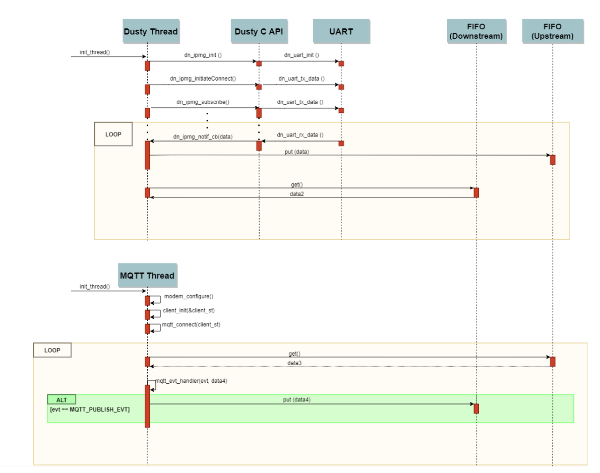

# nRF9160_dusty_over_mqtt
Allows an MQTT client to communicate with a Dusty manager module.

## How it works

### Overview
nRF9160 communicates via UART with a Dusty Manager module. This communication is carried out using the [Dust SmartMesh C Library](https://github.com/dustcloud/sm_clib).

The data nRF9160 receives from the Dusty module is sent to an MQTT public broker through 4G/LTE. Thus, any MQTT client subscribed to the appropriate topic will receive these data.

### Required configuration
Some configuration variables has to be modified in order to successfully run this project. These variables are in ``Kconfig`` and ``prj.conf`` files.
**Once the configuration parameters are properly set, close the Project in SES and open it again in order to apply the changes**

#### Configure MQTT parameters

* Open the ``Kconfig`` file
* The MQTT **publish** and **subscribe** topics can be set in the ``MQTT_PUB_TOPIC`` and ``MQTT_SUB_TOPIC`` parameters respectively.
* The MQTT **client id** can be set in the ``MQTT_CLIENT_ID`` parameter.
* The MQTT **broker** can be set in the ``MQTT_BROKER_HOSTNAME`` parameter.
* The MQTT **broker port** can be set in the ``MQTT_BROKER_PORT`` parameter.

#### Configure APN 

Once you insert a SIM card, you should specify the APN of your telecommunications operator in the ``prj.conf`` file.
This information is set in the ``CONFIG_LTE_PDP_CONTEXT`` variable:

* ``CONFIG_LTE_PDP_CONTEXT="0,\"IPv4v6\",\"<your-APN>\``

#### Configure TLS for MQTT

In case you are connecting to the MQTT broker using TLS:

* Paste your .key and .cert files into the ``/cred`` directory.
* In ``nRF9160_dusty_over_mqtt/prj.conf`` file, set ``CONFIG_MQTT_LIB_TLS`` to ``y``.
* In SES IDE, open this project and click on ``Build``-``Build Solution``.
* Go to ``/cred`` directory and open a terminal there.
* Run: 
  * ``python3 cred.py --CA_cert ca.crt --client_cert XXX.crt --client_private_key XXX.key --sec_tag 51966 --program_app         ..\build_nrf9160dk_nrf9160ns\zephyr\merged.hex`` 
  replacing ``XXX`` with your file names.
* The certificates will be written to the nRF9160DK.

### Optional configuration

You might want to set an **username** and a **password** to connect to an MQTT broker. To do so:

* Open the ``Kconfig`` file
* Set the ``MQTT_BROKER_SET_USERNAME_AND_PASSWORD`` parameter to ``1``
* Set the ``MQTT_BROKER_USERNAME`` parameter with the chosen **username**
* Set the ``MQTT_BROKER_PASSWORD`` parameter with the chosen **password**

Log messages are disabled by default. However, they can be enabled by following these steps:

* Open ``prj.conf`` file
* Set the ``CONFIG_LOG`` variable to ``y``

**Once the configuration parameters are properly set, close the Project in SES and open it again in order to apply the changes**

### Detailed working

The following sequence diagram shows how this project works in detail.

Notice that there are 2 threads: **Dusty Thread** and **MQTT Thread**.

#### Dusty Thread

The Dusty Thread is responsible for the management of the connection between the Dusty manager module and the application.
If you take a look at the code, you will see that the connection is lead by a finite state machine.

Once connection has been established, if a data notification is received from the Dusty manager, the thread immediately starts executing the notification callback function ``dn_ipmg_notif_cb(cmdID, subCmdId, notifData)``, which pushes the received data to the upstream FIFO. Otherwise, the thread loops indefinitely reading the downstream FIFO.
  
#### MQTT Thread

The MQTT Thread is responsible for the management of the connection between the application and the MQTT broker.

It consists of an infinite loop which polls for an event in a file descriptor holding the connection parameters during a certain period.
If the file descriptor is ready, it means the connection is up and we are able to publish data to a topic and receive data from a topic.

Whenever there are data to be received from a topic, the ``mqtt_event_handler(client, evt)`` function is called with the argument ``evt`` holding the type of event has occurred. If this event matches with an MQTT_PUBLISH_EVT, means that we have new data to be picked up from an MQTT_client. Then, these data are pushed into the downstream FIFO in order to be managed by the Dusty Thread.

While there are no data to be received from a topic, the thread tries to read the upstream FIFO indefinitely to publish pending information received from the Dusty manager
